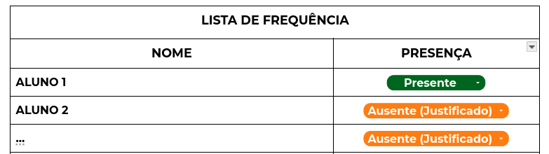

# 📝 Automação de Lista de Presença - PET

Este programa tem como objetivo **automatizar a coleta de listas de presença** do programa PET, a partir de:

- **Um link do Google Drive**
- **Ou uma pasta `.zip` com os arquivos**  

---

## ✅ Requisitos Funcionais

- **RF01**: O usuário pode inserir **um link do Google Drive**  
  > ℹ️ O link deve permitir que **qualquer pessoa com o link possa acessar** os arquivos.

- **RF02**: O usuário pode informar **o nome de uma pasta local** onde estão os arquivos  
  > ℹ️ A pasta deve estar **no mesmo diretório do programa**.

---

## ❌ Requisitos Não Funcionais

- **Versão do Python:** 3.12.3
- **Bibliotecas necessárias:**


ℹ️ Todas as bibliotecas podem ser instaladas automaticamente via:
```bash
pip install -r requirements.txt
```

## ⚠️ Observações Importantes

- O programa **lê apenas arquivos `.docx`**.
- Ele procura uma **tabela com o título**:  

## Lista de Frequência

- A estrutura da tabela deve conter:
- Coluna **à esquerda**: Nome do participante  
- Coluna **à direita**: Status da presença (**PRESENTE**, **AUSENTE**, ou **AUSENTE (JUSTIFICADO)**)



---

## 📅 Nomeação dos Arquivos

Para garantir a leitura correta da data nos arquivos, recomenda-se que o nome dos arquivos contenha a data **separada por hífens ou underlines**.

### ✅ Exemplos Aceitos

- `ATA 25-05-25 ALUNO`
- `ATA-25-05-25-ALUNO`
- `ATA 25_05_25 ALUNO`
- `ATA_25_05_25_ALUNO`
- `ATA_25_05_25-ALUNO`
- `ATA-25_05_2025_ALUNO`

### ❌ Exemplos a Evitar

- `ATA 25/08/25 ALUNO`
- `ATA_250525-ALUNO`

---

## 🚧 Em Desenvolvimento

Sinta-se à vontade para contribuir ou relatar problemas!
